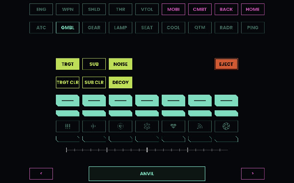

# scmfd

Touchscreen MFD for Star Citizen. A tablet browser drives the game over a uinput
virtual keyboard, which reaches it under Wayland where synthetic X11 input does
not. Panels are JSON; button art is generated from per-manufacturer palettes.

## Setup

    git clone https://github.com/the-grizzly-bear/sc-mfd && cd sc-mfd
    pip install .                 # or: pip install evdev pillow
    python3 -m scmfd serve        # builds art + panels, serves, injects

- `/dev/uinput` must be writable — be in the `input` group, or add an ACL.
- Binding `:80` as a normal user needs
  `sudo sysctl net.ipv4.ip_unprivileged_port_start=80` (persist in
  `/etc/sysctl.d/`); otherwise `serve --port 8080`.

On the tablet, open `http://<host>.local` (or the PC's IP) and add it to the home
screen for fullscreen.

## Autostart with the game

To bring it up when Star Citizen launches, add to your launch script (e.g.
LUG-helper's `sc-launch.sh`):

    if ! ss -tlnp 2>/dev/null | grep -qE ':80 |:8080 '; then
        "$HOME/sc-mfd/start.sh" >/dev/null 2>&1 &
    fi

## Commands

    scmfd art     # regenerate button art from config/palettes.json
    scmfd build   # config/mfds/*.json -> webroot/
    scmfd serve   # build, serve, inject
